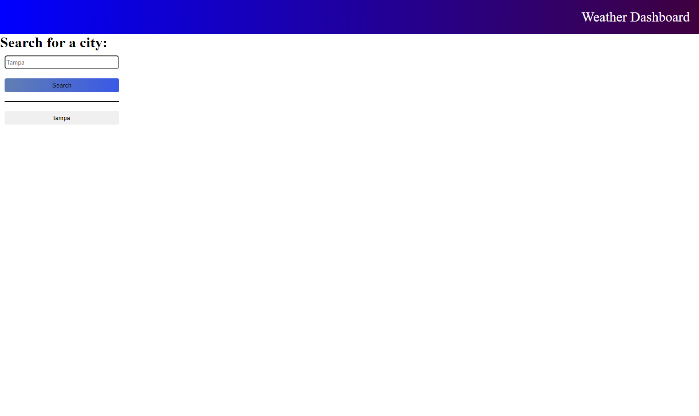

# Weather_Report

## Description
https://josetorres26.github.io/Weather_Report/

</a>
 
Challenge 6 of the ucf bootcamp. this is a regular weather app that uses the openweatherapp api to show you the weather. it shows you the current day and the next 5 days  with everything you need to know to make plans! searches will create a button that saves the information and can be loaded when pressed.
## Table of Contents

- [Usage](#usage)
- [Questions](#Questions)

## Usage

  simply search for a city and watch as you a presented with information!
  after searching you can use the new saved buttons to retrieve information instead of having the search.
## Questions

https://github.com/JoseTorres26

